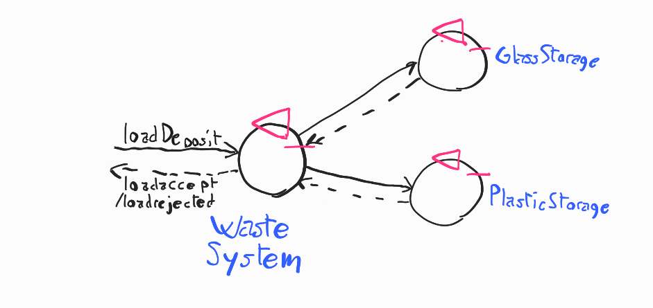
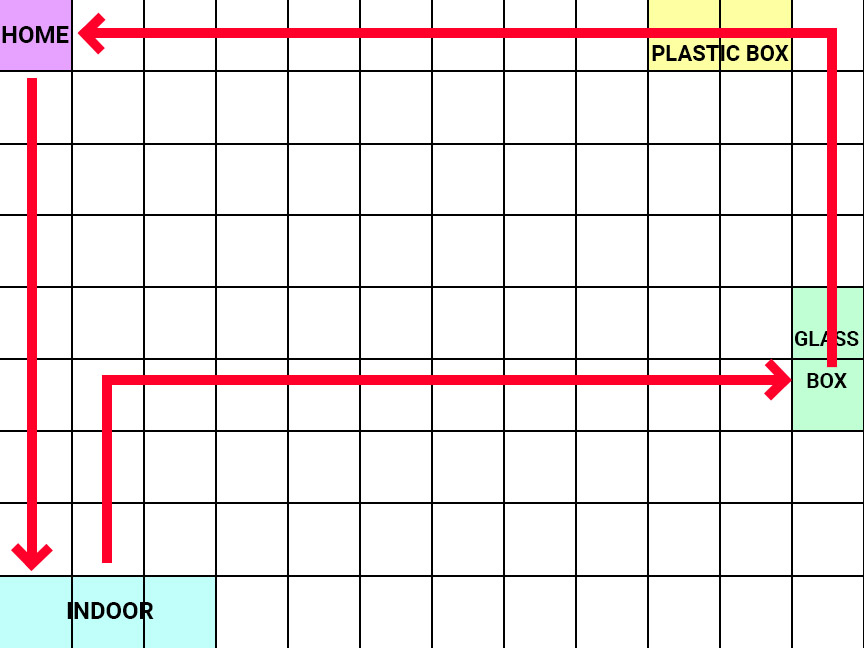

## Analisi del problema

In questa fase di analisi verrà utilizzato il linguaggio ad attori Qak per la modellazione; i messaggi useranno termini specifici del linguaggio per rappresentare le varie modalità di comunicazione, ma non necessariamente corrisponderanno alla tecnologia specifica utilizzata in implementazione.

### Componenti

Data la numerosa quantità di componenti che comunicano tra loro, implementare la logica del sistema come un insieme di attori è abbastanza naturale. 

#### Requisito **request** - componenti

Il WasteService è rappresentato come già detto in analisi dei requisiti da un attore.

Inoltre, per poter interagire con i cassonetti, sono introdotti degli attori di Storage per comunicare modifiche allo storage e inviare aggiornamenti a componenti di controllo per futuri Sprint.

Anche qua due opzioni possibili:
- *Storage manager centrale*: un solo attore che gestisce tutti i cassonetti, tenendo traccia dei contenuti attuali e facendo da unico fronte di comunicazione nel sistema per questi dati. Questo semplificherebbe la comunicazione non richiedendo di distinguere il destinatario in base al materiale, ma richiedendo forse più complessità nel caso, per esempio, in cui i dati di storage siano ricavati da sensori su ogni cassonetto, che quindi dovrebbero aggiornare separatamente lo stesso controllore contenente lo StorageManager.

    ```
    QActor storage context ctxwasteservice {...}
    ```

    

- *Storage manager separati*: un attore per cassonetto (rappresentato nell'esempio sopra), che andrà quindi separatamente interpellato in base al tipo di materiale. La soluzione sarebbe la più intuitiva ma con i problemi sopraelencati.

    ```
    QActor storage_glass context ctxwasteservice {...}
    QActor storage_paper context ctxwasteservice {...}
    ```

    

**Conclusione.** Si è ritenuta migliore la prima opzione, cioè **usare un solo componente StorageManager**, rendendo più semplice la pianificazione e la progettazione del sistema, a livello di architettura e interazione, oltre a rendere più facile l'espansione (per esempio, aggiungendo altri tipi di cassonetto) tramite configurazione interna al componente, che nel secondo caso richiederebbe la creazione di nuovi componenti.


### Requisito **deposit** - La deposit action

#### Posizione delle aree di interesse

Da requisiti, si suppone che le posizioni e grandezza delle aree di HOME, INDOOR, e cassonetti vari, siano decise a priori e a priori comunicate al trolley prima dell'inizio del movimento. Riguardo a come questo sia deciso si consulti [Configurazione](#configurazione).

#### Pathfinding

Data una posizione di partenza e di arrivo verso la quale il trolley deve navigare, questo può calcolare due tipi di percorso:
1. Dividendo la stanza in una griglia quadrata di lato RD, il trolley può semplicemente navigare lungo le direzioni cartesiane, prima ad una coordinata della destinazione e poi all'altra.

    

    **PRO**: si dispone già di componenti in grado di generare e seguire percorsi su griglia in direzioni cartesiane, l'implementazione sarebbe quindi semplice
    
    **CONTRO**: più lento dell'alternativa.

2. Il trolley compie un percorso diretto a destinazione ignorando la griglia.

    

    **PRO**: il percorso sarebbe diretto e più veloce.
    
    **CONTRO**: non disponendo di componenti già implementate per questo scopo, andrebbe programmata la logica di pathfinding e navigazione per questa casistica.

**Conclusione.** Data la scala ridotta del problema, e la scarsa urgenza di esso, si ritiene migliore la prima opzione, la **navigazione cartesiana**, che permette di riutilizzare i componenti di navigazione di robot già a disposizione ottimizzando i tempi di sviluppo.

#### Gestione della deposit action

Esistono più opzioni per quanto riguarda quale componente
debba gestire la deposit action:

1. Trolley potrebbe svolgere internamente la gestione dei vari passaggi, ricevendo da WasteService solo le istruzioni per iniziare una deposit action. Questo richiederebbe di spostare la logica di business dentro al Trolley, in parte.

2. Il Trolley potrebbe essere un puro attuatore, offrendo un' "interfaccia" di operazioni primitive, cioè *spostarsi verso delle coordinate*, *caricare i rifiuti* (da WasteTruck) e *scaricare i rifiuti* (nel cassonetto). Il WasteService si occuperebbe di gestire la successione dei passaggi di una deposit action, mentre il Trolley necessiterebbe solo di gestire la sequenza delle operazioni primitive del BasicRobot per raggiungere le posizioni, non conoscendo logica di business.

**Conclusione.**  Per avere una migliore gestione dei dati, e non dividere troppo la logica di business tra nodi diversi, abbiamo deciso per la seconda opzione, **trattare il Trolley come attuatore e lasciare a WasteService la gestione dell'azione di deposito**. Questo porta a una semplificazione della struttura interna del Trolley, ma al contempo ad una complicazione di WasteService, che deve contemporaneamente gestire richieste e risposte con WasteTruck, e i passaggi della deposit action. 

Per una formalizzazione degli stati, si consulti [Architettura Logica](#architettura-logica).

Inoltre, questa modalità permette di assolvere il requisito **indoor-more-requests** senza richiedere interazioni apposite tra WasteService e Trolley in caso di nuove richieste durante l'operazione precedente; nel primo caso, sarebbe stato necessario far conoscere al Trolley l'arrivo di richieste per permettere di sapere se tornare o meno ad HOME.

Per poter verificare i requisiti, è necessario poter conoscere la posizione del Trolley, in termini di quale luogo di interesse è stato raggiunto. Visto che con questa modalità Trolley non conosce le posizioni delle vare aree di interesse (dato che riceve direttamente comandi per spostarsi a una certa coordinata), è necessario che comunichi a WasteService la sua posizione numerica. Per farlo, in maniera coerente con il metodo di navigazione scelto si divide la stanza in una griglia, con caselle quadrate di lato RD (grandezza del trolley, da requisiti). Le coordinate dei luoghi d'interesse sono così indicate:

- (0,0) è la casella in alto a sinistra della stanza.
- (X, Y) è la casella X caselle a destra, e Y caselle in basso, rispetto a (0,0)
- Un luogo d'interesse copre una o più caselle, ed è delimitato indicando casella in alto a sinistra e casella in basso a destra.

#### Idee per possibile ottimizzazione

Si è notato infine che, data la staticità dell'ambiente, i percorsi in caso di funzionamento regolare hanno un numero ridotto, essendo sempre tra le stesse (e poche) posizioni. Quindi, se necessario, potrebbe essere possibile precalcolare i percorsi, e riutilizzare sempre gli stessi senza richiedere la generazione ogni volta; nel caso per qualche motivo il trolley si ritrovi in una posizione fuori dalle aspettative, il percorso andrebbe comunque calcolato ad hoc.

### Configurazione

Da requisiti, diversi valori, cioè

- *DLIMIT*
- La posizione di HOME
- La posizione e area di INDOOR
- La posizione e area di GLASS BOX e PLASTIC BOX

sono impostati a priori. Questo può essere realizzato cablando i valori nel codice, ma l'opzione più sensata è quella di usare dei file di configurazione, modificabili dall'utente.

In questo SPRINT, considerando solo il core business dell'applicazione, l'unico componente che necessita di conoscere i dati di configurazione è WasteService. Quindi, il file di configurazione sarà collocato all'interno del suo nodo.

Un esempio:

*WasteService.json*
```json
{
    "positions": {
        "HOME": [[0,0], [0,0]],
        "INDOOR" : [[0,15], [3,15]],
        "GLASS_BOX" : [[13,0], [14,0]],
        "PLASTIC_BOX": [[16,4], [16,5]]
    },
    "DLIMIT": 50
}
```

### Interazione

#### Requisito **request**

È necessario che (in caso di loadaccept) il waste truck sappia quando lo scarico dei rifiuti da parte del trolley è stato completato per poter ripartire. Ci sono diverse opzioni: 

1. La risposta (loadaccept) potrebbe essere semplicemente inviata solo a scarico completato, a differenza di loadrejected che verrebbe inviata appena possibile. Una volta arrivata la risposta, il camion potrebbe partire. La conseguenza di questo approccio sarebbe l'impossibilità di rilevare errori da parte del Waste truck: "vedrebbe" nella UI un'attesa senza sapere se è per via dello scarico rifiuti in corso oppure per un errore.

2. La risposta (loadaccept) arriva subito come per loadrejected, per informare il Waste truck il prima possibile, e viene inviato un successivo messaggio pickedUp per notificare l'avvenuto scarico e la possibilità di partire. Questo richiede che il Waste truck sia anche in grado di ricevere passivamente messaggi, e non solo inviare richieste e ricevere risposte come da requisiti; è possibile, ma richiede accorgimenti più specifici nello sviluppo.

    ```
    Dispatch pickedUp : pickedUp()
    ```

**Conclusione.** Si ritiene migliore la seconda opzione, **la partenza del camion dopo un dispatch pickedUp**: il vantaggio dal punto di vista dell'utente (non necessariamente competente nella tecnologia) nel sapere subito se è stato accettato o meno il carico, e non rimanere bloccati in una schermata di attesa o equivalente anche in caso di successo, vale la pena di avere ulteriori accortezze in implementazione.

Inoltre, WasteService deve poter sapere da StorageManager lo stato attuale di riempimento dei cassonetti.

1. Questo potrebbe essere implementato come una request-reply, chiedendo a StorageManager lo stato dei cassonetti.

    ```
    Request storageAsk : storageAsk(MAT)
    Reply storageAt : storageAt(MAT, QNT)
    ```

2. Potrebbe essere implementato come un evento inviato da StorageManager a ogni modifica dei contenuti, o in modo simile rendendo i cassonetti risorse osservabili.

    ```
    Event storageUpdate : storageUpdate(MAT, QNT)
    ```

**Conclusione.** Per adempiere a questo requisito si è ritenuta migliore la prima opzione, **request-reply**; nel secondo caso, WasteService dovrebbe salvare in una variabile interna di stato il dato aggiornato ogni volta che lo riceve, cosa che potrebbe avvenire in qualunque momento, invece di chiederlo semplicemente all'occorrenza.

TODO: immagine modello

TODO: modello eseguibile

#### Requisito **deposit**

Il Wasteservice, come specificato in [Gestione della deposit action](#gestione-della-deposit-action), si occupa dei vari passaggi del deposito. Deve quindi poter inviare messaggi a Trolley per coordinare questa operazione. Deve inoltre sapere quando Trolley termina le operazioni per e le successive.

1. Questo potrebbe essere implementato come una serie di dispatch, con un singolo dispatch per le conferme di operazione conclusa.
    ```
    Dispatch trolleyMove : trolleyMove(X, Y)
    Dispatch trolleyCollect : trolleyCollect(MAT, QNT)
    Dispatch trolleyDeposit : trolleyDeposit(MAT, QNT)
    Dispatch trolleyDone : trolleyDone(_)
    ```
2. Oppure, in alternativa, come diverse richieste, a cui Trolley risponde a operazione conclusa:
    ```
    Request trolleyMove : trolleyMove(X, Y)
    Request trolleyCollect : trolleyCollect(MAT, QNT)
    Request trolleyDeposit : trolleyDeposit(MAT, QNT)
    Reply trolleyDone : trolleyDone(_)
    ```

**Conclusione.** Si sceglie la seconda opzione, modellare le operazioni primitive come **request-response**, perchè permette a Trolley di non conoscere WasteService ma di agire solo in risposta a delle richieste.

Inoltre, per iniziare lo scarico nel cassonetto viene comunicato il deposito di un materiale da parte del trolley:
```
Dispatch storageDeposit : storageDeposit(MAT, QNT)
```
Questo messaggio viene inviato da Trolley a StorageManager, ed è necessario per trattare allo stesso modo la situazione di test virtuale e il caso reale; infatti, un caso reale potrebbe usare un sensore nei cassonetti per aggiornare i dati sui contenuti noti a StorageManager, mentre in una situazione virtuale questo deve essere necessariamente contenuto tramite messaggi.

In un caso reale, bisogna quindi testare la consistenza tra dati noti a StorageManager dopo l'invio del messaggio, e i dati reali dei contenuti. Un test plan per questo caso è il seguente:

TODO: test plan dati veri vs dati messaggi

Il modello per le componenti correlate a deposit è il seguente:

TODO: immagine modello

TODO: modello eseguibile


### Architettura Logica

Ecco quindi l'architettura logica del sistema in generale per questo SPRINT:

TODO: immagine architettura logica

TODO: immagine stati Trolley

TODO: immagine stati WasteService

TODO: modello eseguibile architettura logica

Per scopo di prototipo e simulazione, i Waste truck vengono trattati come attori, ma nel caso reale sarebbero "alieni" al sistema, inviando dati dall'esterno, probabilmente tramite una GUI (web o analoga) usabile dal camionista. Essi, come specificato in [Interazione: request](#requisito-request), devono comunque disporre di una componente software in grado di rimanere in ascolto di messaggi, oltre che inviare richieste.

## TestPlan

#### TestPlan: request

Testplan in Java: [TestRequest.java](./prototipo/test/TestRequest.java)

- **Test Deny**: il camion invia una richiesta di deposito al WasteService per una quantità maggiore di quella che i cassonetti possono ospitare e questo risponde con un *loadrejected*.

- **Test Accept**: il camion invia una richiesta di deposito al WasteService, che risponde con un loadaccept. Il WasteService invia quindi un messaggio al camion che indica che il carico è stato prelevato dal trolley.


#### TestPlan: deposit

Testplan in Java: [TestDeposit.java](./prototipo/test/TestDeposit.java)

- **Test deposit**: Inviata una richiesta al trolley, questo invia un messaggio comunicando di aver recuperato il carico, dopodichè, depositato il carico, invia un messaggio allo storage manager comunicandogli la quantità di materiale depositato. Infine il WasteService riceve il messaggio *doneDeposit* che indica che il trolley ha terminato il proprio lavoro.
